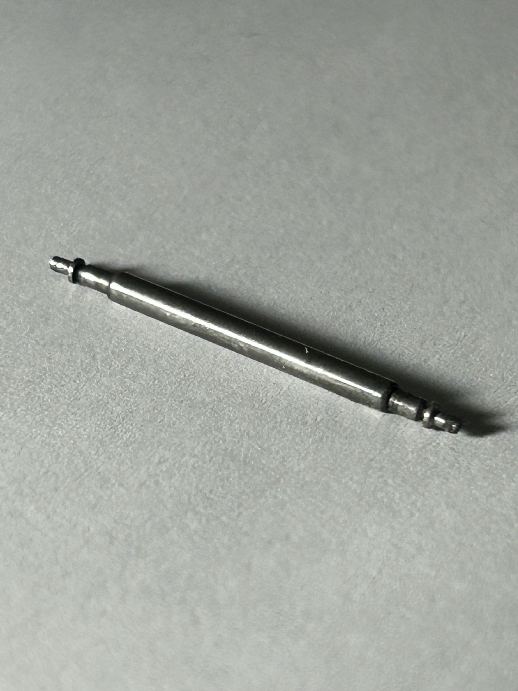
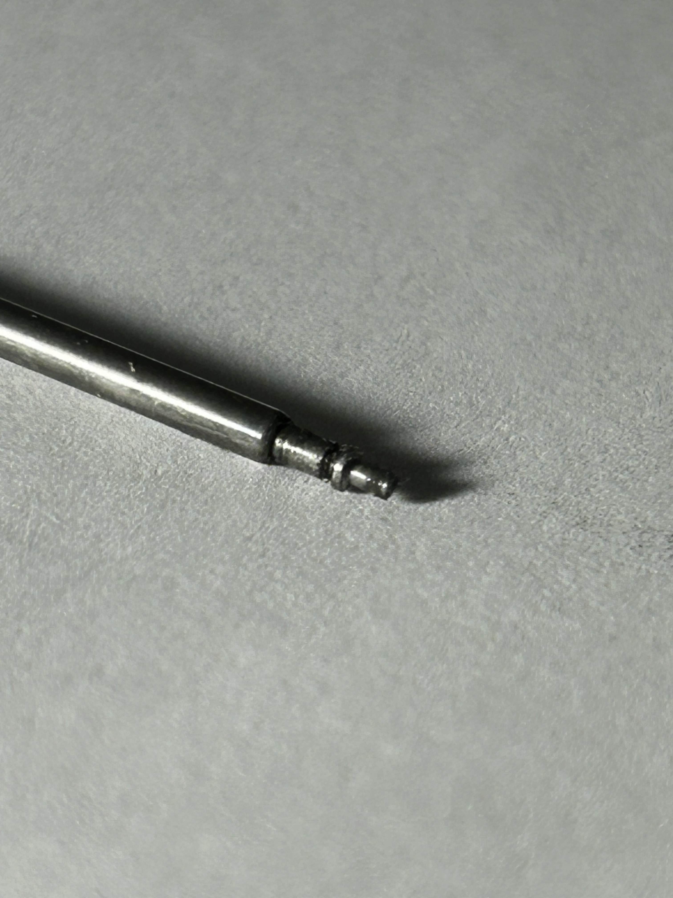

# A1 – [Creating Portfolio]

## Objective

**1st GitHub portfolio**- [Alexandre Allonas](https://www.alexandre-allonas.fr/)
Analyzing this portfolio, navigation to projects and other important tabs are easily accessible with a navigation bar clearly presented at the top of the page. Within each page there are consistent titles, headers and other forms of identification, that allow for ease of understanding. For example each project is clearly labeled and shows dates of completion and what role Allonas performed.
Although this portfolio provides tooling used to complete the project there are no key specs regarding any of the provided projects. This leads to the projects being descriptive but not reproducible. No CAD files, wiring diagrams or codes are provided. Colleagues or others may be able to infer what to use, but cannot immediately reproduce it without having to ask for guidance.
The portfolio mostly showcases what was built, however it doesn’t show why specific decisions were made. Many projects have a timeline stated and a description of what the project's goals are, it doesn’t however explain what tradeoffs considered, constraints encountered, or alternatives rejected. The VTOL project specifically had entry states discussing success, then another entry stating the validity of success on another run, yet provides no design iterations or failures from beforehand.
The language  is appropriately formal and free of casual filler, reading like something you hand to an employer that showcases everything professionally. Technical terms are used appropriately without over explaining, which shows fluency rather than fluffing. On the About page there are sentences that are longer and more reflective, appropriate for the page, also very well structured and not just a list of buzzwords strung together.

**2nd Portfolio**- [Casey Boykin](https://uncc.instructure.com/eportfolios/5029/home/landing-page)
Boykin’s portfolio handles navigability well, the sidebar lists every assignment individually and sequentially. This sets the portfolio apart from others which have drop down tabs, a reader can easily locate a specific assignment in seconds just from scrolling through the sidebar. The numbering system this portfolio has also helped with finding the projects sequentially.
On reproducibility, Boykin’s portfolio appears to go further than a typical portfolio listing out projects completed successfully. This portfolio has equations, software, and shows the process to which they used for the final results, most of the time. This alone allows for others to look at the project and easily understand what stage it took part in the grander scheme of things.
Evidence of reasoning is where the portfolio shines, Boykin shares the process of his decision making and its consequences. The section where Boykin states the reasoning for the a design choice in a project car, is the best example for this section, the choices lied between using a rubber band to propel the car or using an Arduino with a motor attached to it. The reasoning behind it was one had a single uncontrollable variable, whereas the other had far more control over variables, however it cost more to implement. The project ultimately decided it was best to spend more, to ensure the best result. This reasoning shows what the problem was, and why the solution was chosen. It showcased the learning method and didn’t just dump the result. A professional looking to understand Boykin’s way of reasoning would be able to see that clearly.
There are some instances where the professional tone is lost throughout the portfolio, it appears to be casual and personal, which is perfectly acceptable for a portfolio made for a class, however if this were a portfolio to be presented professionally it would need polishing. Technical vocabulary is used correctly and confidently throughout the pages, concepts such as torque, stress, free-body diagrams, 2-D, and 3-D equilibrium are used and explained such that a reader or colleague can understand. 

## Analyze

### a) Product Purpose
The purpose of the product is to provide a compression-spring-loaded axial pin that spans and constrains two fixed points (the case lugs), allowing temporary axial retraction at either end for tool-assisted insertion/removal, while supporting a rotating strap (watch strap)  loop along its shaft in normal use.

### b) What equation or physical principle governs its primary behavior?
#### i) Mechanism and Governing Equation

This product has a mechanism in which its governing principle is torque equilibrium of a spring-loaded bar. The equation used in this product is Hooke's Law:

F = k·δ

Where:

- **F** = axial force that provides the hold
- **k** = spring constant
- **δ** = distance needed for the stem/bar to retract

  
#### ii) System Behavior

The two lug holes are coaxial and rigid, so the spring's reaction force is reacted entirely by the case geometry rather than by elastic deformation of the lugs. This allows the equation $F=k\delta$ to describe the whole system.

### c) Photograph and Analyzation of Spring Bar

*Figure 1. Outer tube: its outer diameter sets the surface the strap loop rotates around, its length sets the fixed spacing reference between the two lug holes and is what the strap actually pivots on.*

*Figure 2. Two telescoping end tips: the taper/chamfer geometry at each tip is what lets the pin self-center and "pop" into the lug hole under spring load without manual alignment, and the tip's reduced diameter and length relative to the lug hole is what defines how far it must retract before it clears the hole edge during removal.*

### d)
### i) Product patent and Alternatives
**US Patent:** US2308505A  
**Inventor:** Arthur J Geoffrion

##### Alternative 1 — Audemars Piguet Watch Spring Bar (US8790004B2)

The AP watch spring bar provides the same function as the patented axially removed spring bar, however this spring bar requires no tooling to compress and disengage it, however it does require dedicated geometry in the strap to hold it in place, less parts in exchange for longer disassembly time. It would also require the entire case to be redesigned to accommodate the unique design of the retention pin.

##### Alternative 2 — Screw Bar/Pin
Opting for a screw bar/pin often used in traditional diver watches is a different alternative. Same retention capabilities, however it would require the use of special tooling to easily swap straps out.

### ii) Design Decision
The classic spring bar tapers both tips symmetrically rather than fixing one tip rigidly and only making the other end spring-loaded. This geometry means the bar self-centers itself regardless of which hole is drilled slightly off-tolerance. It allows a single tool motion to remove it at either end, since both tips retract independently into the same central spring. This is likely a manufacturing/assembly decision. A symmetric part can be produced and installed without keeping track of orientation, and it tolerates real-world variation in case spacing across many different watch models without needing size specific pins.

## Decide
**1. Homepage Identity**: The homepage is designed to give a professional reader an immediate understanding of what this portfolio contains, how the information is organized, and the level of documentation they can expect. It identifies the site as an engineering design portfolio and explains that the assignments document the analysis, decisions, and communication behind each design process. The navigation organizes the work by assignment so that a reader can move through the semester and locate specific evidence efficiently. This approach is intended to help an instructor, engineer, or potential employer understand both the purpose of the portfolio and the professional documentation standard used throughout it.

**2. One Intentional Customization**: I changed the portfolio's typography to Times New Roman throughout the site. This change better supports the requirement for clear and professional engineering documentation by using a familiar, highly readable font that is commonly used in formal academic and technical documents. The template's default typography was designed for general web reading, but Times New Roman provides a more document oriented appearance that better matches the purpose of this portfolio as a formal engineering portfolio.

**3. Documentation Standard**: For every assignment entry this semester, I will provide clear evidence of my analysis, explain and justify my design decisions using relevant engineering criteria, and present the final work in a professional format that allows another engineer to understand and evaluate my process.

## Communicate
*See [About Me](docs/aboutme/index.md) for this section, as per assignment instructions.*

