# A2 – Truss Stress Analysis

## Objective
For this assignment we as a class were given parameters for lightweight truss. We were instructed to use A500 structural steel. Outlined below are the specific given parameters. Findings include forces at the external, internal, and at the joints. This A2 page will showcase the findings using our given parameters.

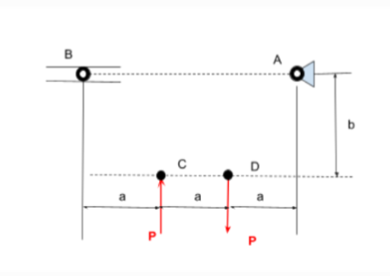

Shown in the figure above, a is, 0.4 meters, b is set at, 0.3 meters, and P is chosen between 20-30 Kilo Newtons, with the one at joint C pointing up, and the one at joint D pointing down. Joint A is a pin connection, while joint B is a roller pin.

## Decide
_Which geometry did you select, and why? This is your first open design choice in the course — defend it._

**Actual Design of Truss**
When looking at the given parameters, it immediately takes the shape of trapezoid, so my proposed design took that initial thought. However, having no supports in the middle made me wary, since most trusses incorporate some sort of internal bracing. Adding internal members is what allows us to continue with solving the truss using principles from Statics. Thus it led me to using the statically determinate equation to start off with solving the truss marking the first step taken to finding the forces. 

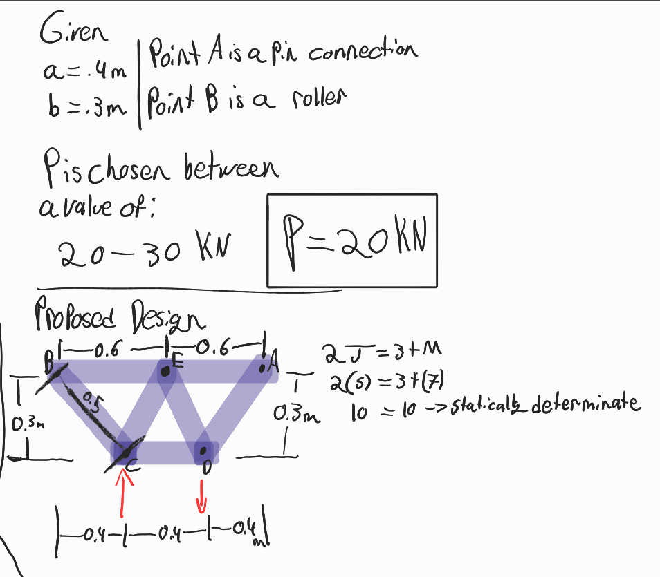

**FBD of Truss**

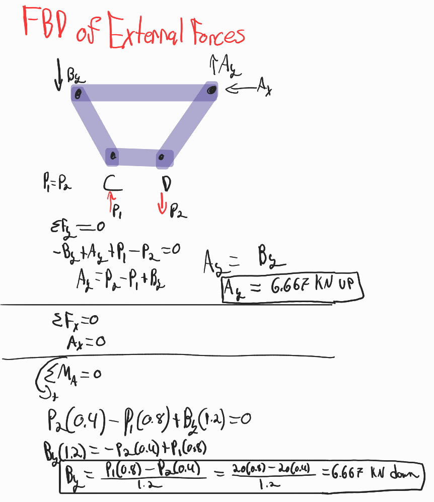

After determining that the truss is solvable using principles from statics. I continued with finding the reaction forces of the truss, making an FBD to aid in this process. After making the FBD I quickly found the reaction forces at pins A and B. This then left me to find the internal forces.

**Internal Forces/Forces at the Joints**
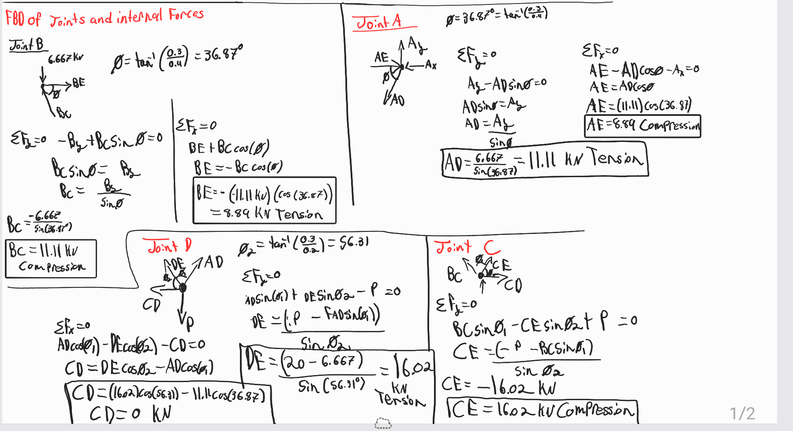

I started with Joint B because it had the least amount of forces acting upon it or in other words, the least amount of unknowns. Then moved onto Joint A, by taking a moment around it I was able to determine the forces in the members AD and AE. This is when I first noticed a pattern but wasn't completely sure. After I had solved Joint C I was sure of it, the truss although mostly symmetrical had one important detail that made the Internal members alternate between compression and tension. That being the fact the the loads at C and D, although acting in opposite direction yet had the same magnitude, this meant I could've simply found Joint A, B and C and assumed the rest of the joint to be equal in magnitude but opposite in direction.

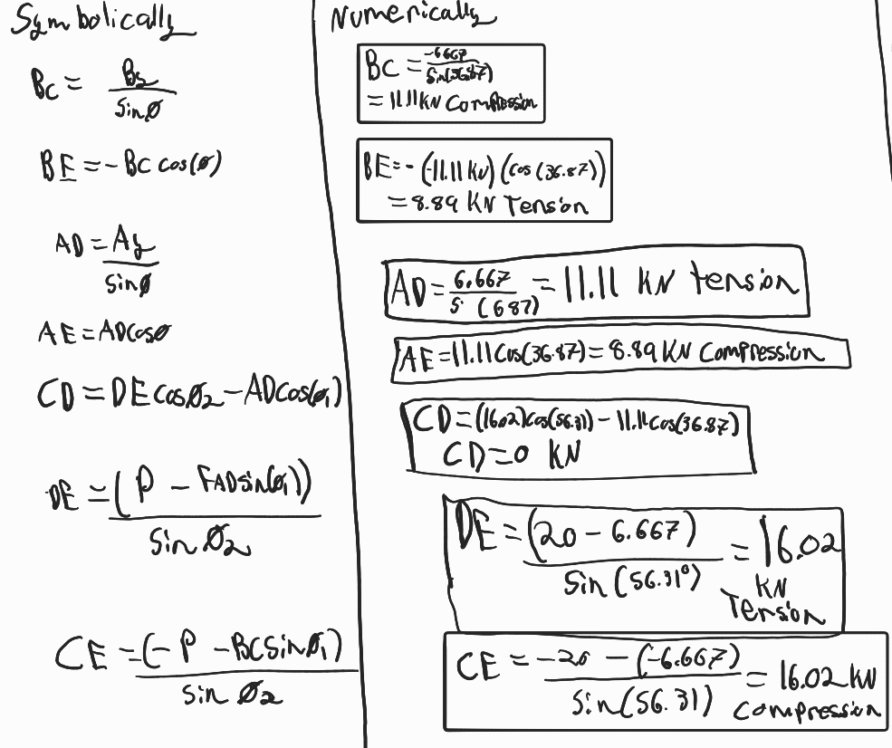

Although I had already found the internal members symbolically and numerically  I found the need to put it all in one place for ease of references for the future equations. This method of representation is also ideal as it lets us easily see how the members are truly equal in magnitude, just opposite in direction.

**Cross Sectional Areas and Weights**
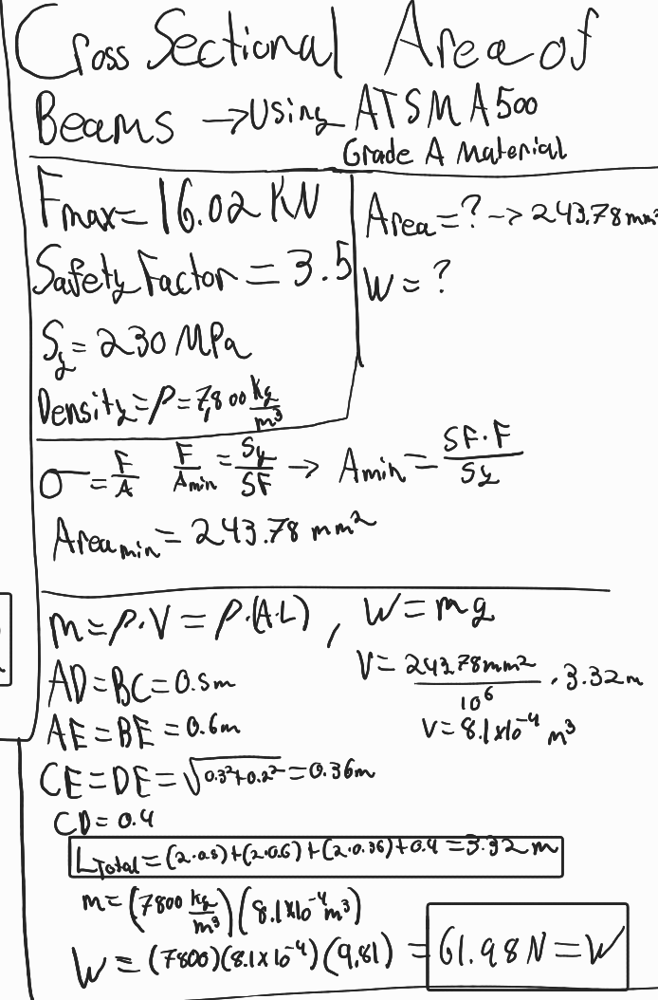
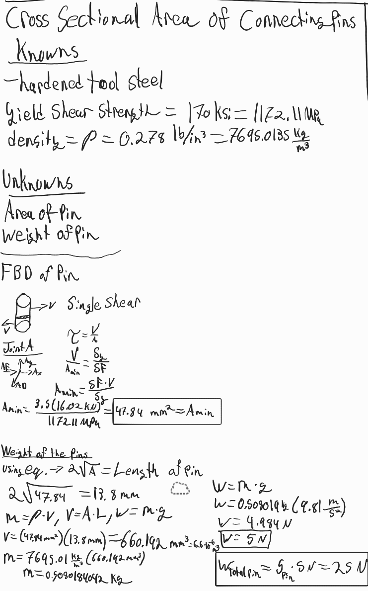

As shown above the truss was calculated with a safety factor of 3.5 for added strength. I also did some research regarding A500 as we were not provided with the yield strength nor the density, which is required when finding the weight. I used the following [website](https://www.beamdimensions.com/materials/Steel/ASTM/ASTM_A500/), This website provided me with all the unknown parameters, I ended using the Grade A material for the calculations. Yield strength was recorded at 230 MPa, and density at 7800 kg/m^3.

After finding the area of the truss we can then move onto finding the weight of the truss, using total length of truss, along with then finding mass of truss.

Area of the pins was a bit more work to find, as we had to convert the values from English to SI units.
Using the same equations, I used when calculating the weight of the truss, I first found the volume, then the mass, and finally the weight.

**Initial Extrusion**
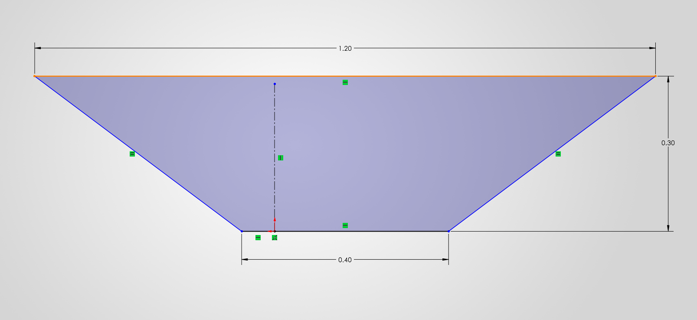
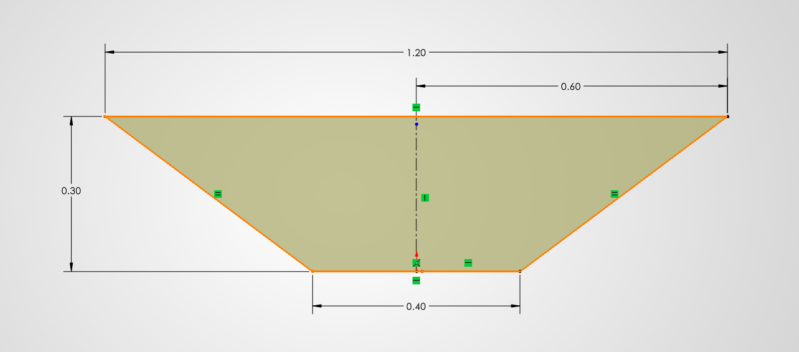
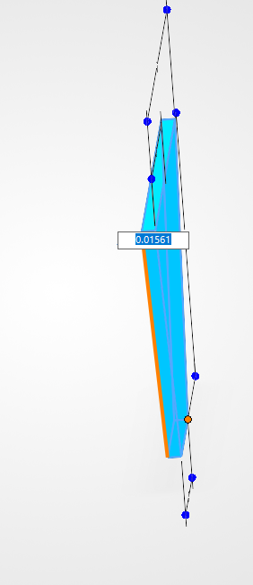

The pictures shown above show the steps I took to create the truss. First I created the overall truss shape along with the constraints it took to get the shape fully defined in Solidworks. The second picture shows how the shape will look like extruded with no cuts. Lastly the final picture shows the thickness of the truss, which I had previously calculated but forgot to upload a picture before I deleted my notes.

**Extrusion Cuts**

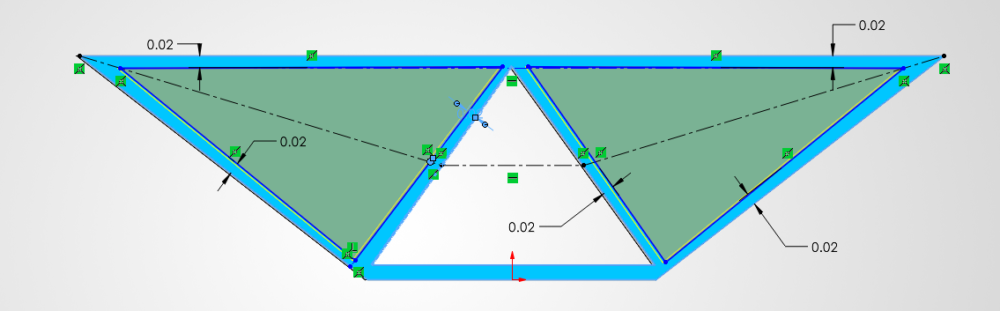
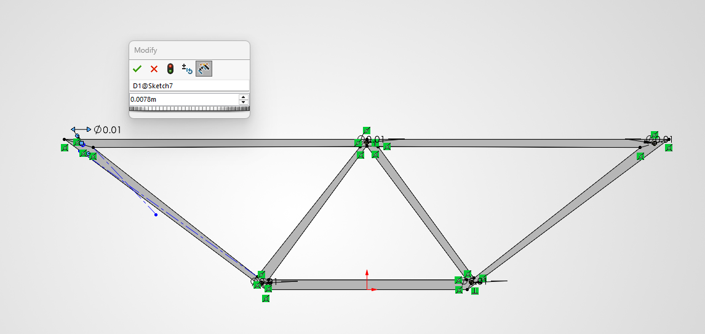

These next three pictures show the processes used to make the truss look less like a metal slab and more like a truss. I first started with the section in the middle, I felt like this was the most appropriate way of starting out as this would allow me to find better symmetry for the other two cuts needed. The secondary cuts were made using a combination of construction lines with defined parameters which allowed me to get similar cuts, but since I'm not proficient with Solidworks as of yet it looks off, and in all honesty, it's probably not the best way to go about making a truss.

**The Pin**

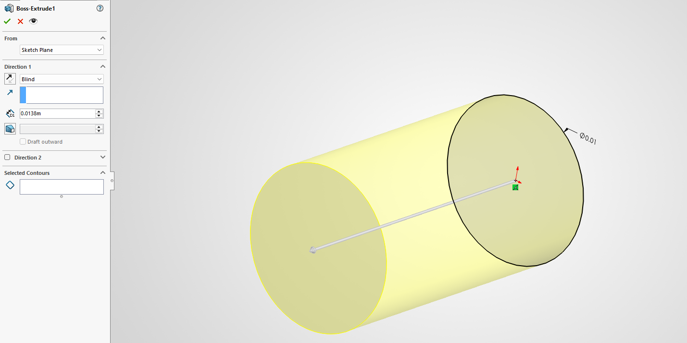

This is the pin diameter and pin length, previously calculated, however it seems that my calculation went awry, and I ended up with an incorrect length, that did not coincide with my trusses overall thickness. Thus leaving me with pin holes not fully covered. Another thing to note are the mates, none of my mates lined up, this is again a user error from my part, not having the knowledge on how to properly use Solidworks led to many shortcomings in the final steps of this assignment.

**Properties**

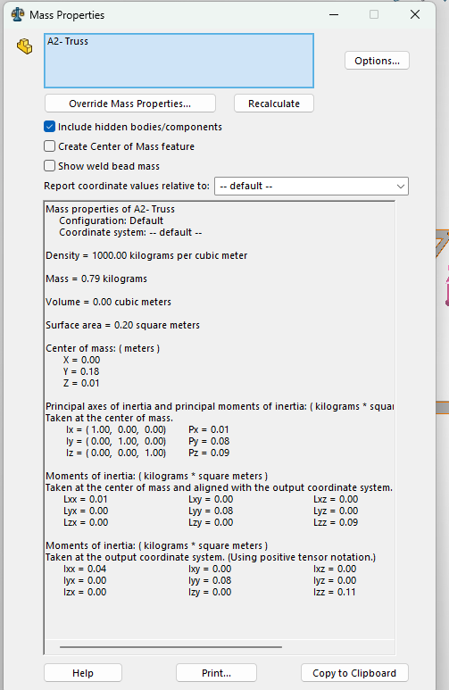

The mass and properties shown above are not correct in the slightest, as when I was downloading the file I forgot to change the the properties to a similar steel to A500. This is also paired with the fact that when I wanted to fix the mistake my version of Solidworks was incompatible with the file itself, another issue to resolve before starting any work using Solidworks. 

This is a Zip file containing my [Solidworks Assembly and Parts](SolidworkParts.zip)

## Communicate
This weeks assignment taught me a lot about how Solidworks operates, it's definitely a step up from Creo, a CAD software I had previously used, however not knowing how to accommodate for the differences definitely hindered the latter part for the assignment. There is some major room for improvement in the upcoming assignments, in which I hope to have a better grip over unlike this one. This assignment also taught me that solving trusses is one thing, and that actually creating the truss in a 3D space is another, it has allowed me to be more open minded on how to approach given parameters, as there are multiple ways to tackle a problem. No one way is right, there may be preferred methods of course, however I think the most important thing to takeaway is that no matter what method you choose, the basics will never change, so as long as those stay intact, there is a probability that the final solution is close to the desired.

