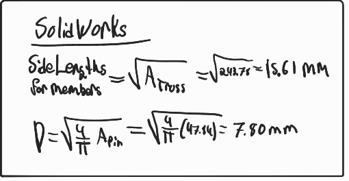

# A2 – Truss Stress Analysis

## Objective

[Solidworks Assembly and Parts](SolidworkParts.zip)

## Decide
_Which geometry did you select, and why? This is your first open design choice in the course — defend it._

## Communicate

