# A3 – [Topic]

## Objective
For this assignment, our class was instructed to design a circular bar made of Aluminum, which must have the following parameters:  an applied force of 300-500 lbf, a Young's Modulus of (8.5- 11.5) x 10^6 Psi, and a max axial deflection of 0.009 inches. We were to then conduct an FEA (Finite Element Analysis) on the bar and compare our results to our hand calculations.
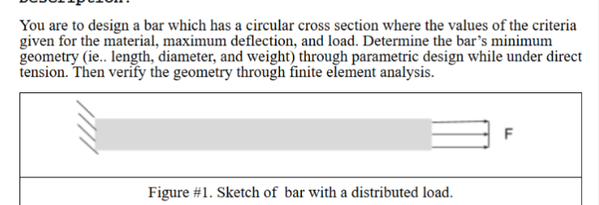
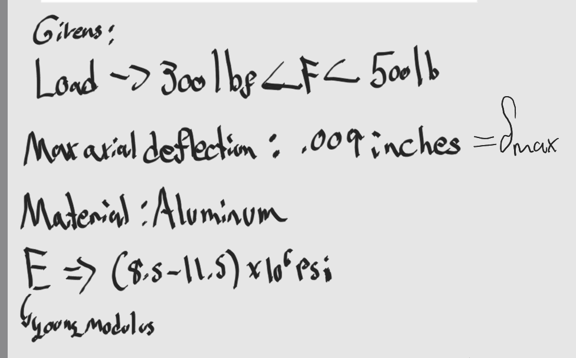

We are to choose the following to design the full bar:Force, Young's Modulus. I chose the force to be equal to 500 lbf, and Young's Modulus to be 8.5 x 10^6 Psi. We were also not given a specific diameter, nor length or area. Diameter was tricky to choose but I ended up choosing a smaller diameter which was 0.25 inches or 1/4 inches.

With the chosen diameter I can then find Area, and using the Deflection formula I can find an appropriate length for the bar. 
## Parametrically Designing A Circular Bar

Below I show the work involved after choosing the parameter of my bar. The second picture shows the equation used for the finding of the area and length of the bar. The third and final picture shows the fully solved Area and length eqautions.
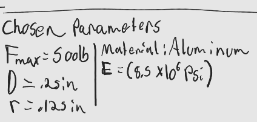
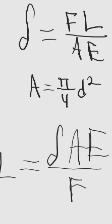
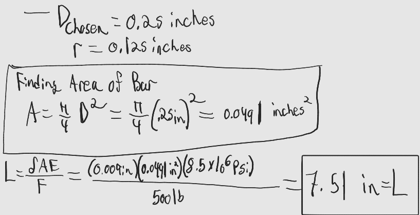

My area for this bar with the diameter came out to be: 0.0491 inches squared (in^2). Now I initially wanted to do a really big diameter, something along the lines of 10-20 inches, however after solving for the length I realized that my deflection was so small that if I wanted a big diameter, I was going to have to use an abnormally long bar. This didn't sit right with me, I wanted a shorter bar, so therefore opting for smaller diameter allowed for a shorter length. My length for a 0.25 inch diameter came out to 7.51 inches which although long, it was considerably less than the other bars beforehand.

**Solidworks Time**

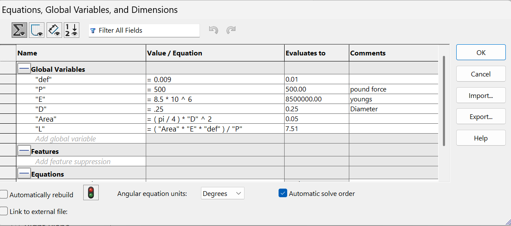

Now after I had solved everything out by hand I was then able to input this information into Solidworks global equations tool, which will allow me to access any given parameter and assign it to the CAD for the specific dimension for less button clicking.

Using the global equations I was also able to solve for area and length within Solidworks, eliminating the need to solve by hand (although I would still solve by hand to avoid mistakes).

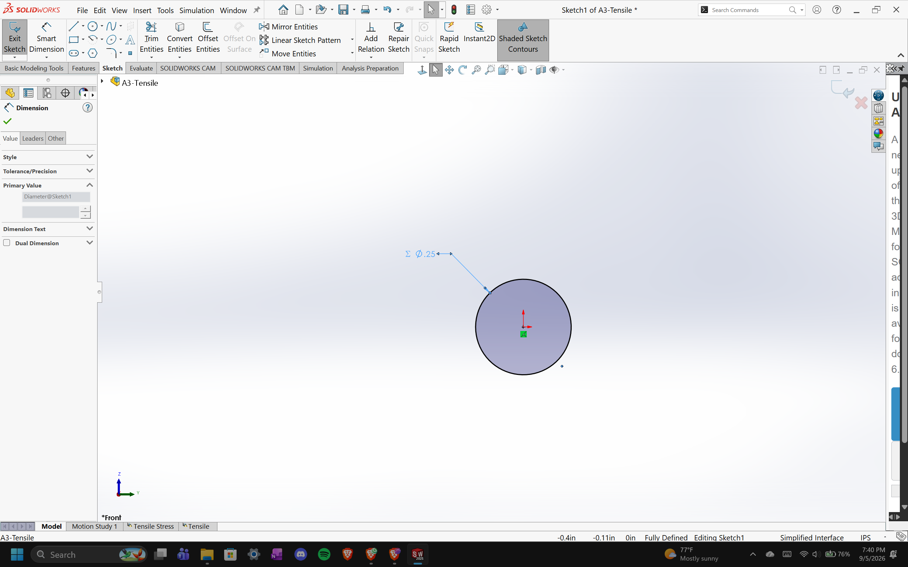
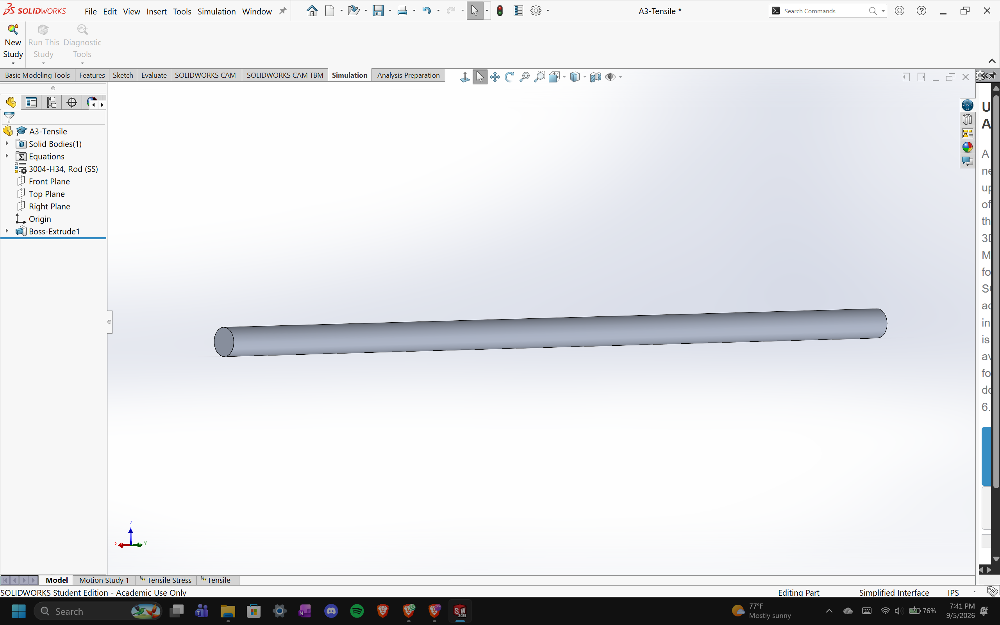

As seen above after I extruded the bar, I assigned my prewritten value for diameter to the diameter of the bar. Furthermore after it, I was able to also assign the length via the global equations function in Solidworks. Thus concluding the assigning of dimensions to the bar itself.

**FEA Time**

Before I could move onto the FEA portion of the assignment, I had to first choose the appropriate Aluminum material property. I ran into a plethora of issues there, as Solidworks did not have an exact Elastic modulus as the one given. Instead of looking for one online I decided to choose the closest one to our given parameter and instead compare by how much my calculations differed from the softwares.

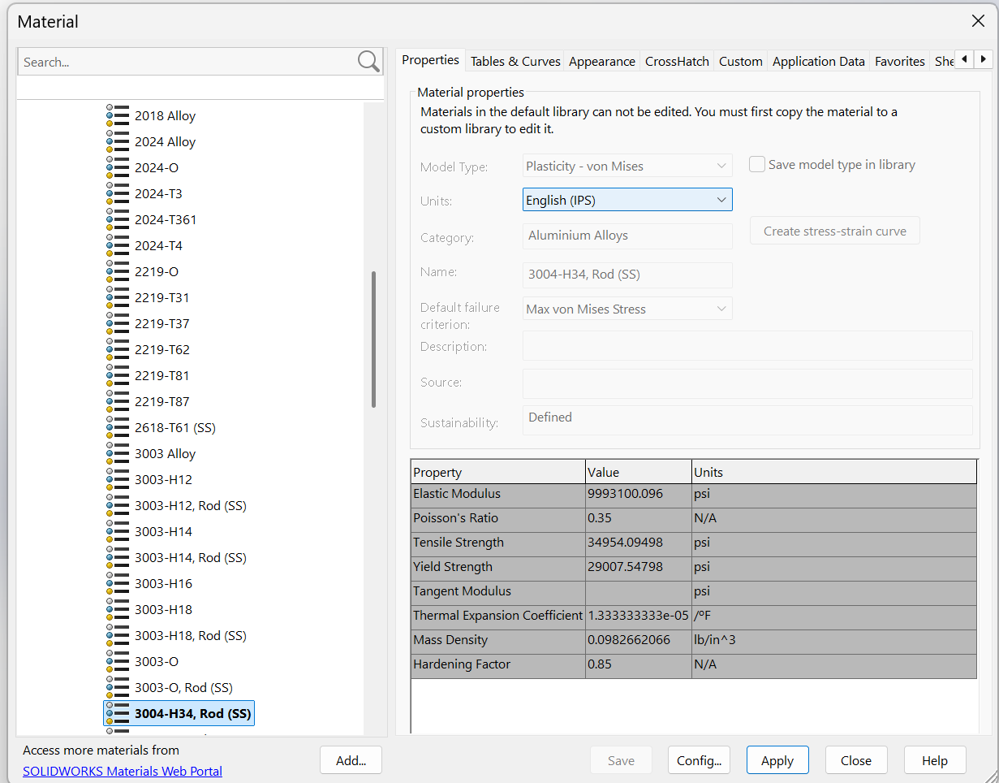

The material I ended up using was 3004-H34, Rod (SS), with an Elastic Modulus of 9993100.096 Psi or 9.993 x 10^6 Psi. Not the closest, however this avoided me from to figure the other variables involved with adding a custom material in Solidworks.

**Running the Study**
To run the study there are a couple of steps needed in order to get a proper result. The first step is to set the bar on fixed geometry, normally when solving by hand we assume which side is the side that is "fixed to a wall", however with software we have to specify, and so by specifying we are then allowed to continue to the next step. That being applying the load, we can choose to apply the load horizontally or vertically, however in the picture provided to us the load is applied axially on the side of the bar. Finally we apply a mesh to the CAD bar, this mesh will allow the software to closely calculate the bars stress, deflection and much more that isn't required by the assignment to be recorded.

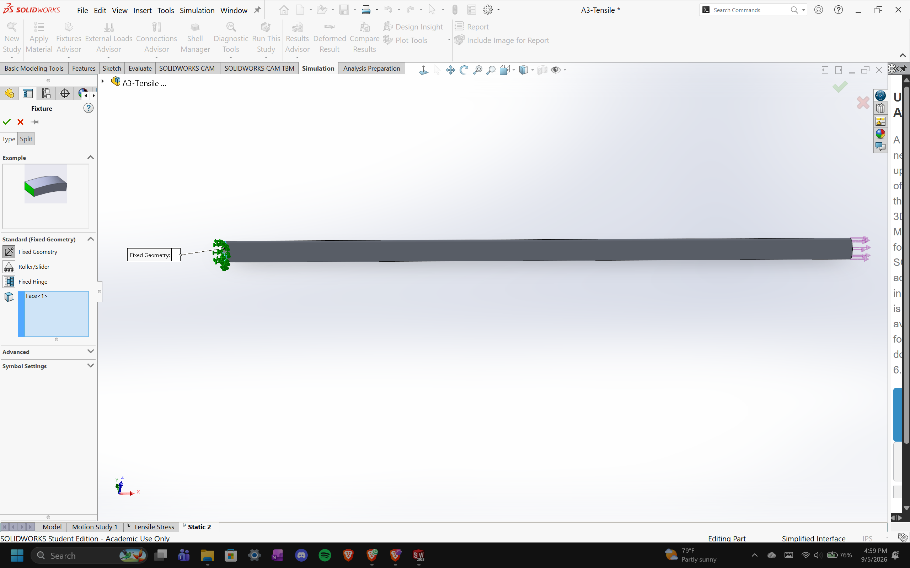
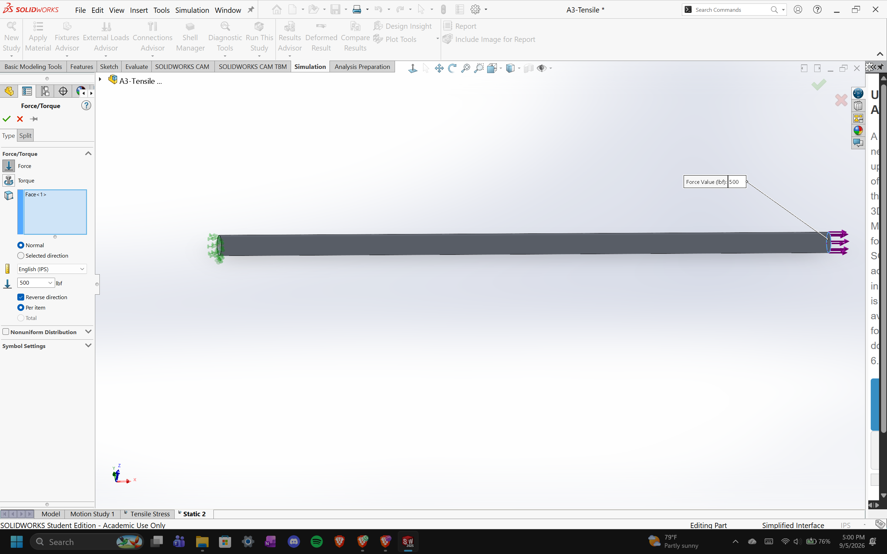
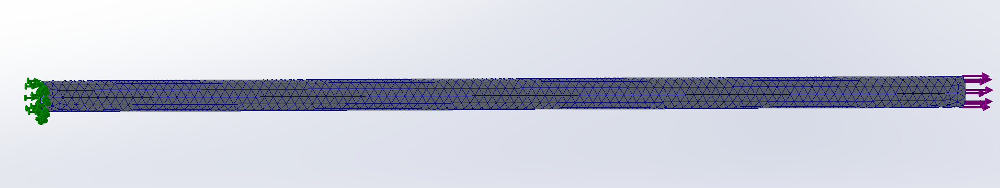

**Results**

The results of the study were honestly surprising, the assignment gave us a Yield strength of 40 ksi, that being 40,000 Psi. The maps generated did not even surpass 11,000 Psi. The actual maximum stress generated was 10727.82226563 Psi, 29,273 Psi lower than our max. We were then asked to find the safety factor for the bar using the Safety Factor equation. 

S.F. = Yield Strength/ Max Stress 

The S.F. came out to be 3.729, almost four times as strong as it needed to be, this is clearly due to using a higher modulus of elasticity instead of the one given. In actuality the safety factor may be 2 times as strong, however I have yet to input the actual modulus of elasticity.

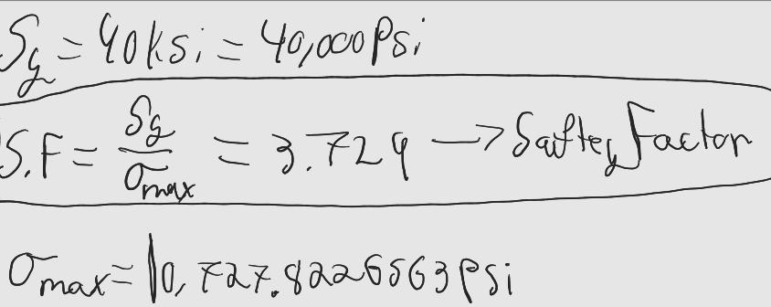

As for the deflection in the bar, the results were also surprising, the max deflection allowed was as we recall, 0.009 inches. The max deflection via the deflection map was 0.007647 inches. As per the assignment I used the values to find the percent difference between both and with a bit of help from Desmos, I was able to determine a difference of about 16%. This is likely due again to the incorrect use of material modulus of elasticity, and maybe partly due to previous calculations done by hand, caused by rounding of numbers before the final calculation. Overall I believe this to be as close as possible, and yields proper results.

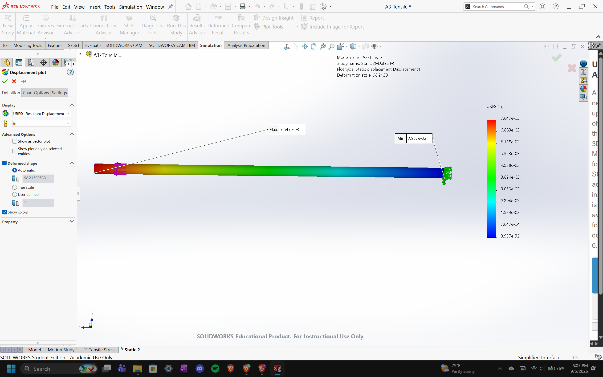

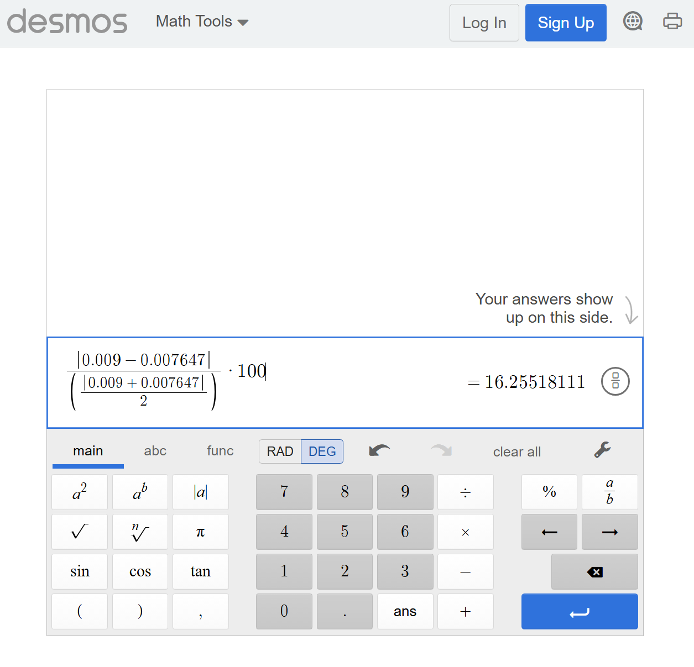

**Random Pin Hole**
_"Now imagine a fairly substantial pin hole on the left side of the bar. Look up the stress concentration factor (Kt) for a hole in a flat bar in tension (Peterson's charts or Machinery's Handbook). Using your FEA's nominal stress away from the hole, estimate the peak stress at the hole and state whether it would still pass your safety factor."_

Assuming the pin holes size to be d = 0.125 inches, and assuming we take the width normally used for this equation as d for the bar we get that D = 0.25 inches. Our K_t has a ratio that corresponds with d/w = d/D = 0.50 

As since d/D = 0.50, K_t approaches values from 2.03 to 2.13, seeing as I could not a conclusive answer as i do not own a copy of the Machinery Handbook, nor could i find a s trustworthy source I decided that I would go with a value of 2.06 for K_t. 

Using this value along with the max stress of the bar (10727.822 psi), we get a peak stress value of 22099.31332 Psi.

To get a new safety factor value we use the yield strength (40,000 Psi) divided by peak stress (22,099.3332 Psi) to get a value of 1.81. This new safety factor would not pass my previous safety factory, however this is still an acceptable saftey factor as it is nearly twice as strong.

## Lessons Learned

Many lessons were learned, from which diameter to use, all the way to which material and how fin/coarse the mesh size should be. In doing this assignment I was able to learn how to use the FEA on Solidworks and I was also able to see how much diameter can affect the length of a bar when you are looking for a specific yield strength and/or modulus of elasticity.

This assignment took me about 4 hours to complete.

