# A4 – [Topic]

## Objective
For this weeks assignment, we were asked to design a motor mount for a [DC Gear Motor](https://www.omc-stepperonline.com/brushed-24v-dc-gear-motor-3-6kg-cm-46rpm-w-99-5-1-planetary-gearbox-pa28-28245800-g100), which will be attached to a rigid wall A. We are given the following parameters:

_"For both features, first design for yield strength and then design for a maximum deflection of .30 mm at the free end."_

We were also given the choice of choosing the material for the part, between the choices there was: ABS, PLA, and PETG. I chose ABS because I had previously heard that PLA tends to deform with temperature, not knowing how hot a DC motor can get I decided it would be best to choose the commonly used ABS. Finally we were given an axial load at the motor shaft which was valued at 300 N.

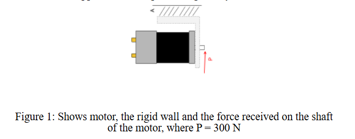
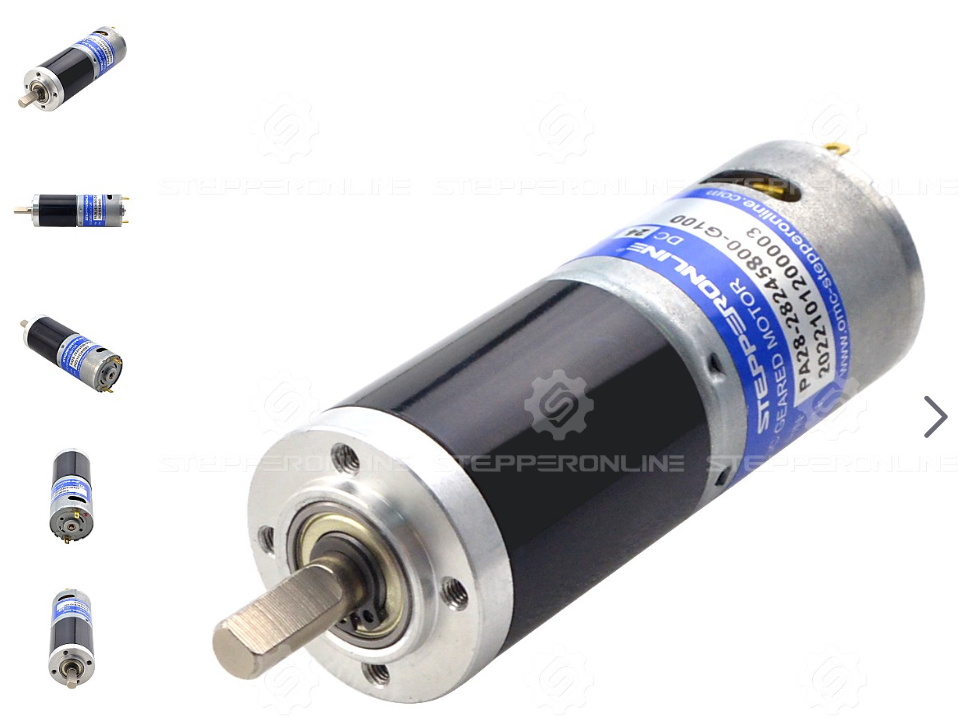
Above are pictures/schematics using the motor mount and motor in its desired ways.

## Feature 1

The first part of the design required me to figure out how big I wanted the motor mount to be when mated up with the motor itself. The motor itself had a max diameter of about 27-28mm, going with the bigger value of the two will allow for better fitment, so that's what I chose. I also found the material properties for ABS as it was stated that we needed to design for the yield strength.
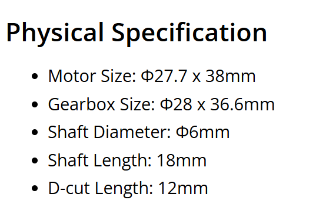

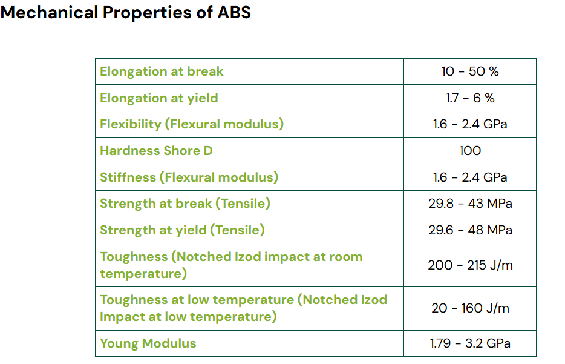

After that I decided that it would be best to give the base a sort of square base as to make it easier to design as I'm still trying to grasp Solidworks. I wanted the motor mount to be as compact as possible (which did not work out as you shall see later) so with that I decided that making the base 32 mm was the best option 2mm of "wiggle" room. 

I also drew a FBD, in order to find out the moment about point A(wall). We had to include the shaft in the drawing to show where the load will be applied. The moment came out to be 5400 N*mm.

The next step for me was to find the height of the base, which for me gets confusing, so I called it the thickness (t). In order to find the thickness we had to use the following:

Max Stress = M*c/I

and 

Max Deflection = (M*L^2)/(2EI)

where E is the Young's Modulus for ABS.

I soon noticed that I was missing one more variable that being the variable I or moment of inertia, rearranging the deflection equation to solve for I gave me 4608 mm^4. I used the inertia to then solve for my thickness (height), and doing so gave me a 12 mm thickness. I used the max stress equation using the relation to yield strength/safety factor, setting it equal to the other relation to max stress --> (Moment * c)/I. solving for t, gave me 10.06 mm. I saw that it was lower and came to the conclusion that it would likely be better to go with the higher value t in order to ensure a better resistance.
**t1 is set at 12 mm.**

## Feature 2
Same deal as with Feature 1 but now attached to wall A, and  we now have a new moment to account for. The length or height of the motor came out to 74.6 mm, adding that with t1, gave me total length of 86.6 mm. In order to take the moment I again took the load and multiplied it by Length total + 18 mm from the shaft length. The moment came out to 31380 N*mm.

Again solved for t using the deflection equation, and expanding the inertia equation. I then went to solve for t using the max stress equation and got a larger value t than with the deflection equation. t2 was now equal to **24.26 mm**, I'm not entirely sure if this was the best outcome, but decided that more material would help with the rigidity. 

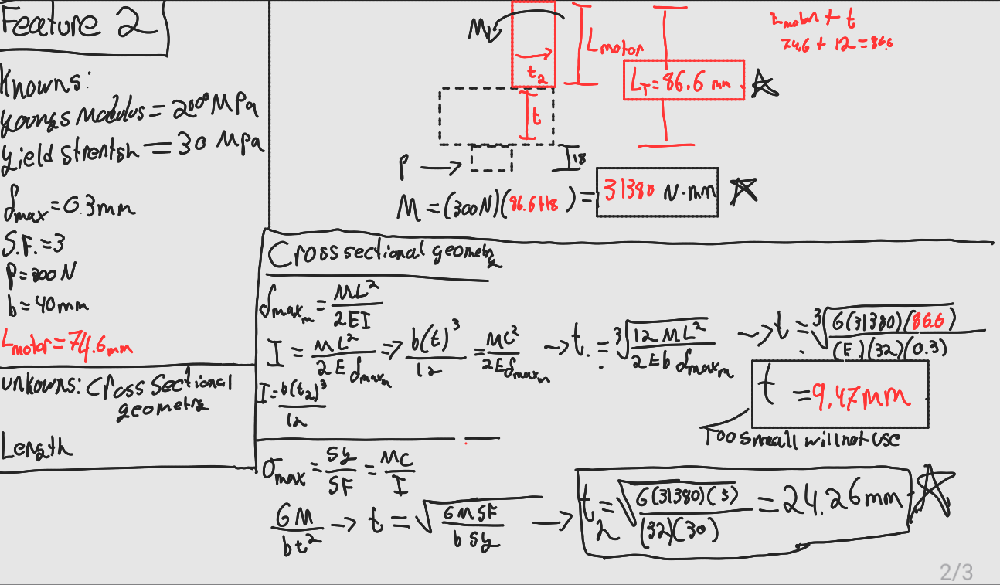

## Isometric Sketch
Now came the sketch in a Isometric view, I remember doing this for 1202, but honestly it was a lot harder than I expected it to be especially doing it on screen instead of paper.
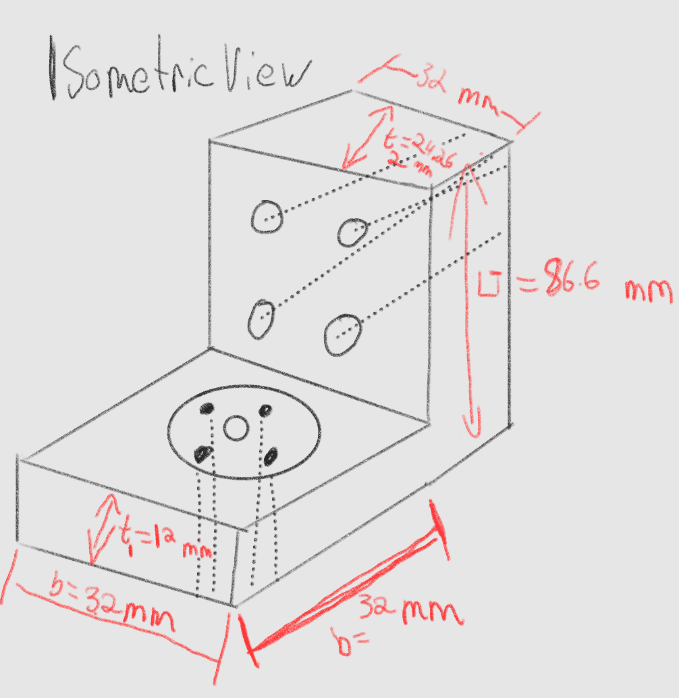
This isometric view contains all the previous dimensions found using the equations. it also includes previews on where the extrusions for the bolt holes and motor will be placed roughly.

## Parametrically Modeling 

To start off I needed to input all of my dimensions into to Solidworks. We were previously told that it was preferable to use the built in equations manager in Solidworks, as this will allow us to check our equations and results for any discrepancy's or mistakes. 

Although frustrating and painstakingly long to input, I finally managed to get my equations and variables set into Solidworks, as seen below.
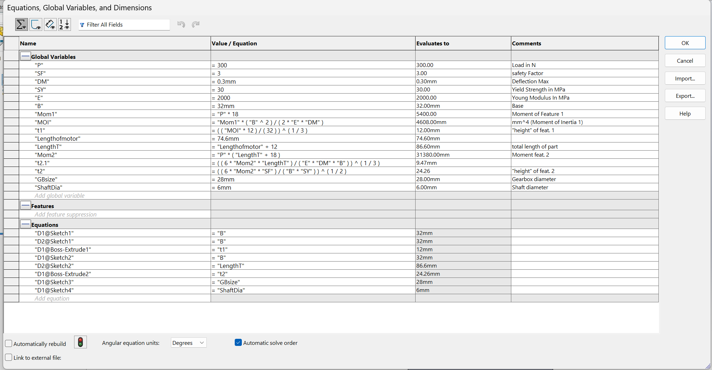

I decided to sketch the features separately to showcase that they really are two "features". As seen below in the following pictures.

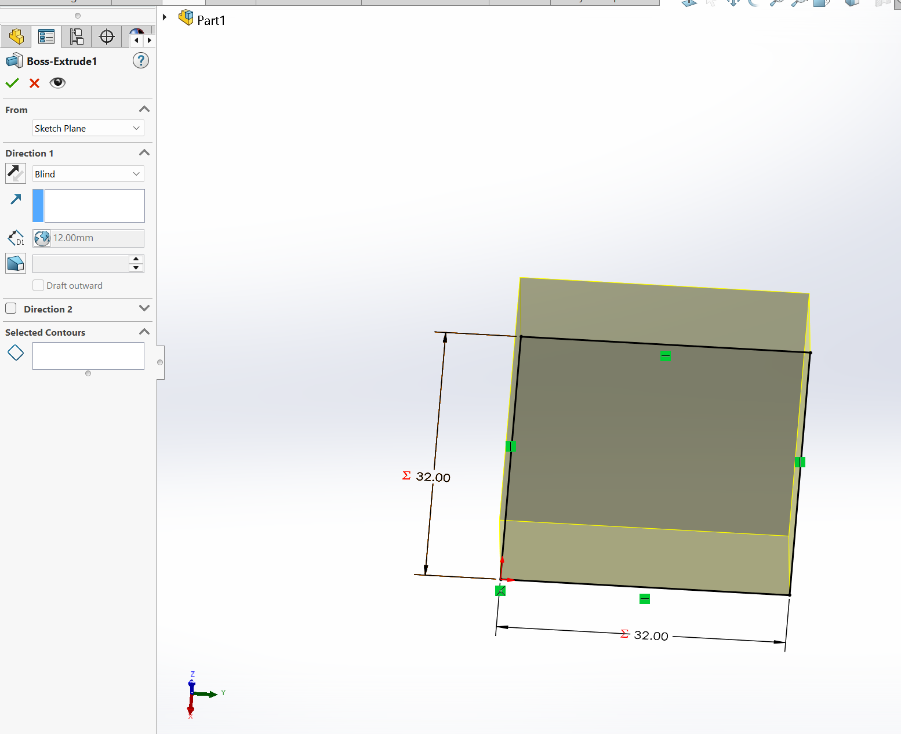

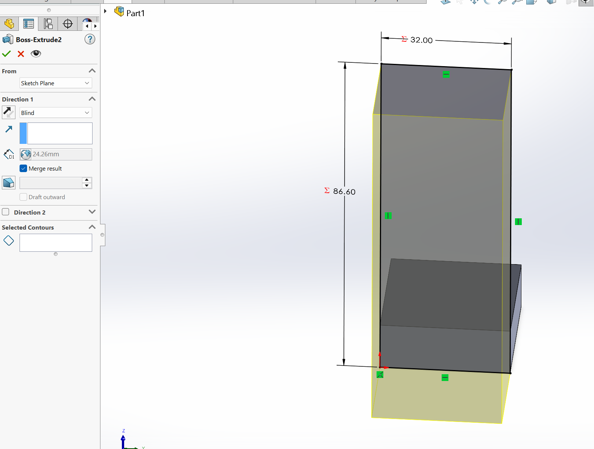

I then started to cut out the holes needed for the various different mechanisms required. I first made and an extrusion cut and set it to the diameter of the motor and gave that cut a depth of 3 mm to allow the motor to "sit" in the motor mount, this ensures it won't just slip out. I then made a smaller hole for the shaft of the motor with a diameter of 6 mm, naturally that had to go through the whole feature in order for it to poke out. Upon further review it would seem that the shaft will only have 2mm poking out, this will need changing in the future.

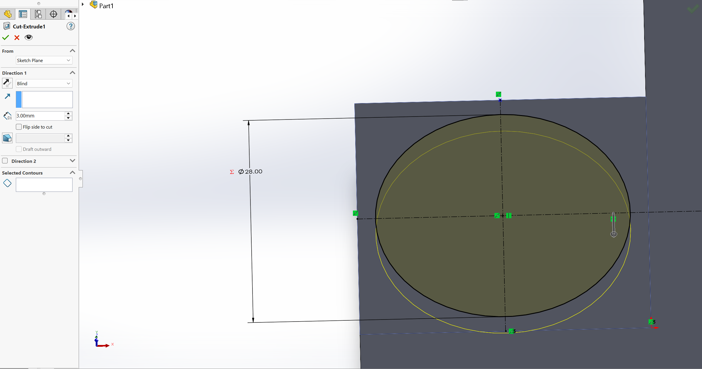
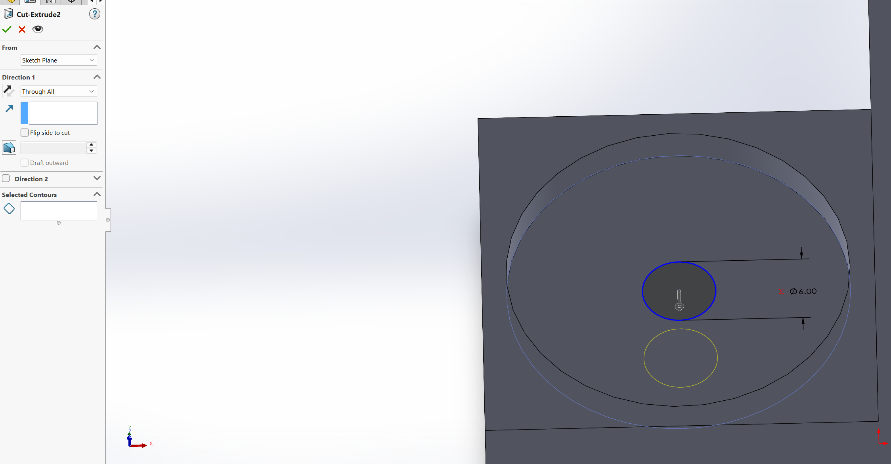

Finally I could add the holes for the bolts, the given measurements for the bolts are 3.44 mm diameter. At first I had no idea on how to line them up, I wanted to use the pattern tool but I couldn't figure out how to use it properly, gave up and instead opted to just set the bolt holes at a certain distance from the shaft hole. As for the bolt holes on feature 2 those were set in place with the help of centerlines and dimensions taken from the edge of the extrusion itself, they lined up nicely and again I tried to use the pattern tool, but failed.

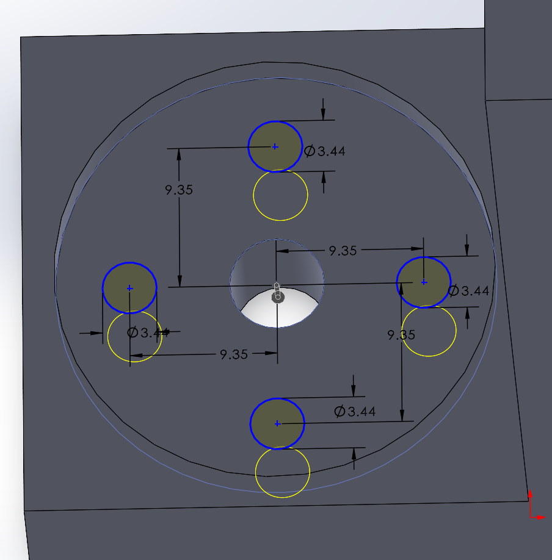

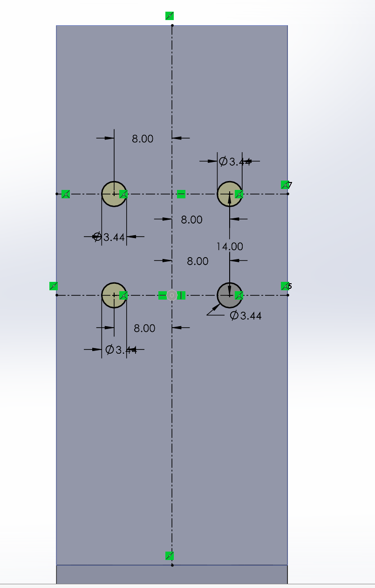

## Minimizing Deflection

This assignment tasked us with one more thing at the end, this was to add yet another feature, this time to minimize deflection, taking inspiration from different products such as shelves, trusses and motor mounts. It seemed that the common thing to do was to add some support triangles between the features to ensure that they maintain a rigid position even under load. I saw that best option was to have the supports out of the way as much as possible, in order to leave some room to easily replace the motor if it ever goes bad.

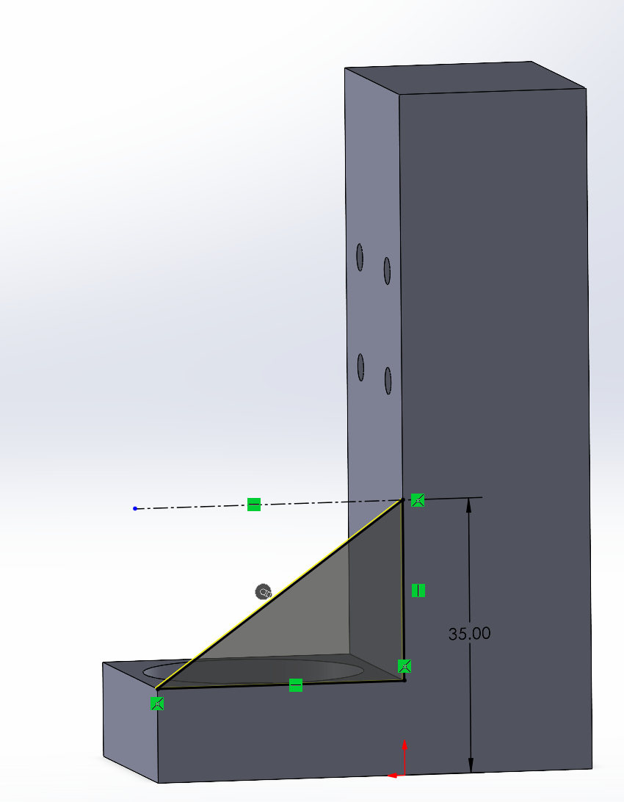

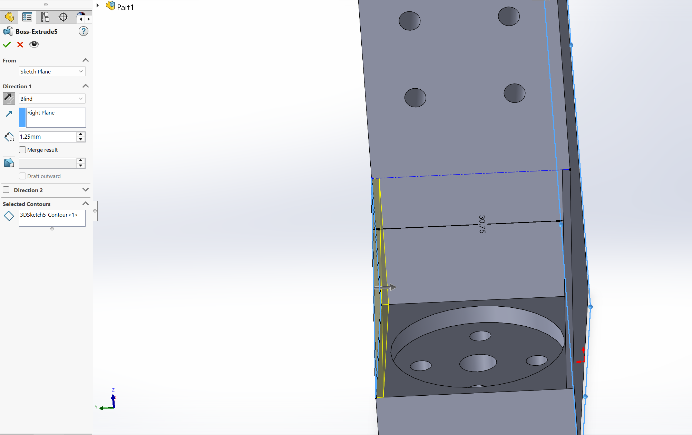

The fully designed motor mount with the ABS properties from Solidworks.

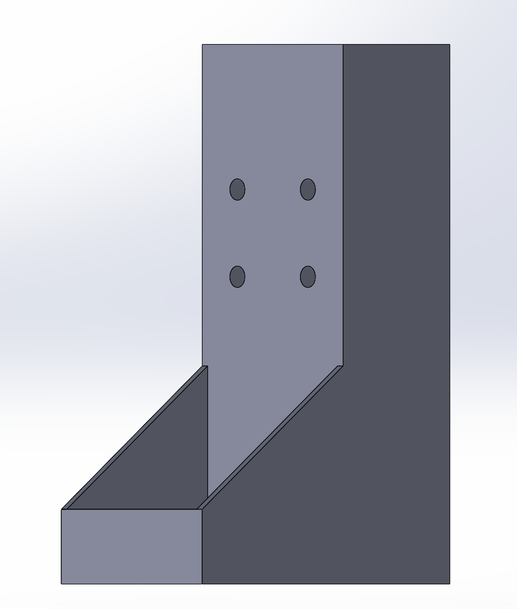
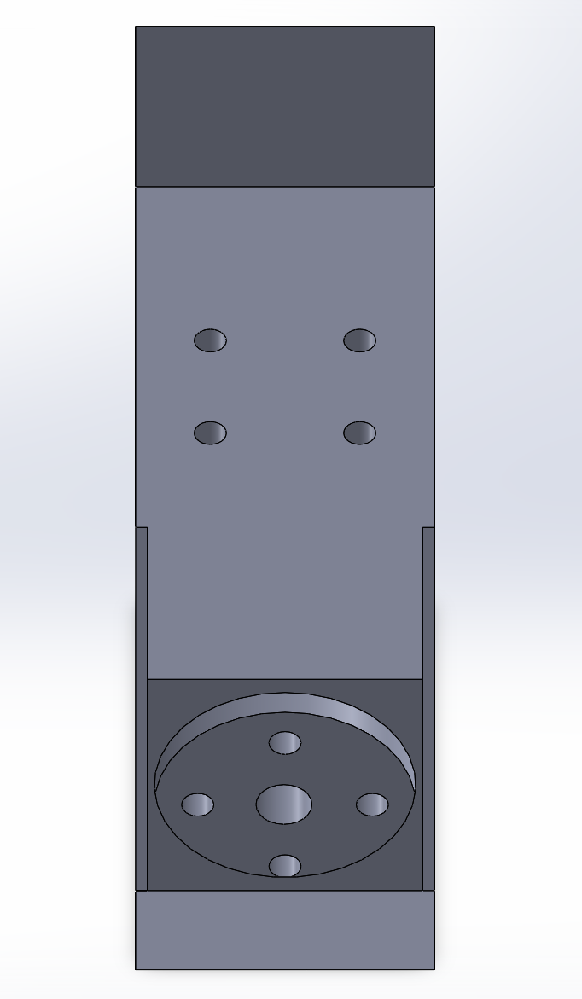
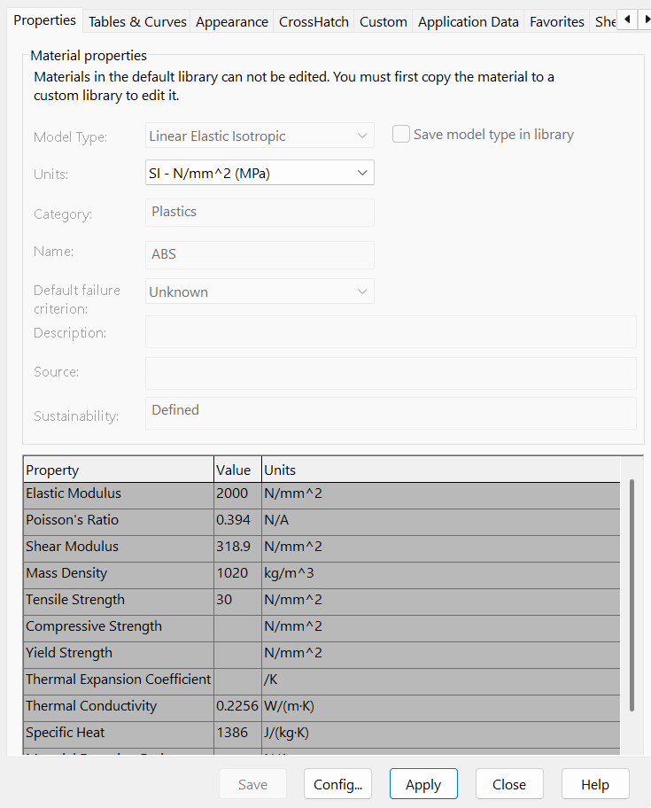

## Communicate
This assignment taught me how to manipulate equations upon equations in order to get the desired outcome. This assignment also taught me that I can't just focus on the equations I also have account for the product and how it will be iterated into the design, allowing for proper usage and ease of repair. In the future i hope to be more mindful about what it is I want the design to do, instead of just focusing on the numbers on a screen.

**This assignment took me about 6-7 hours.**

**Click here to download the [A4_MotorMount](A4_MotorMount.SLDPRT)** 

