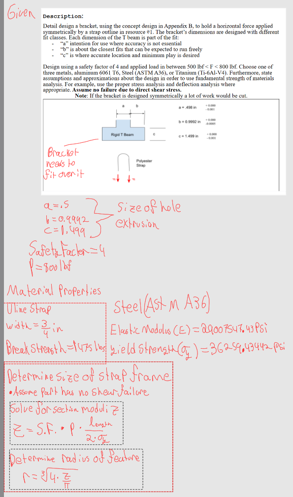
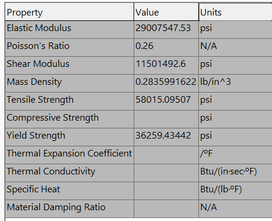
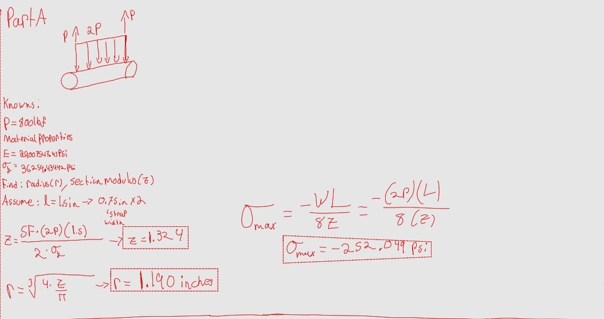
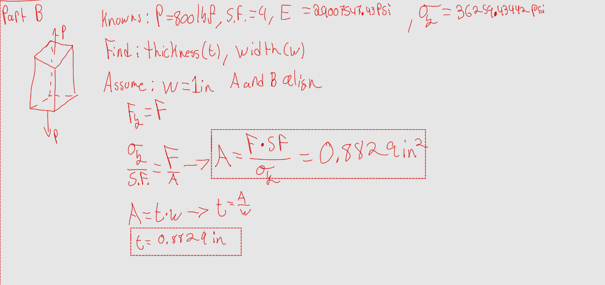
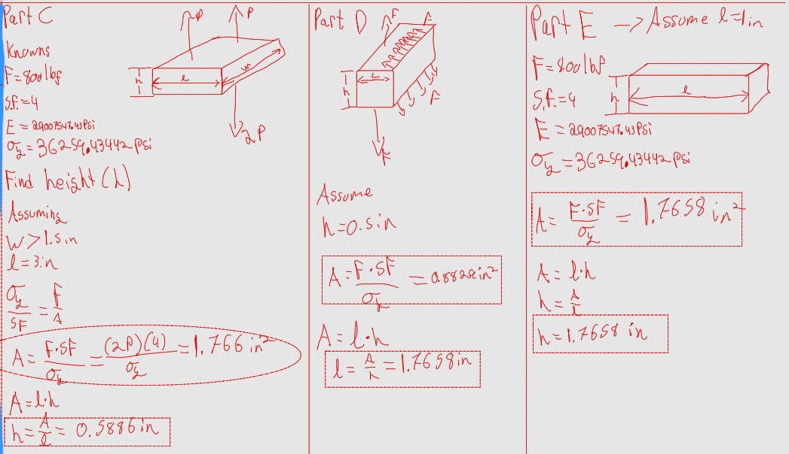
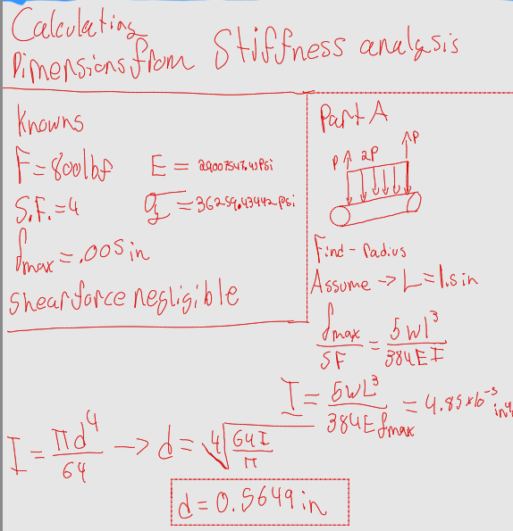
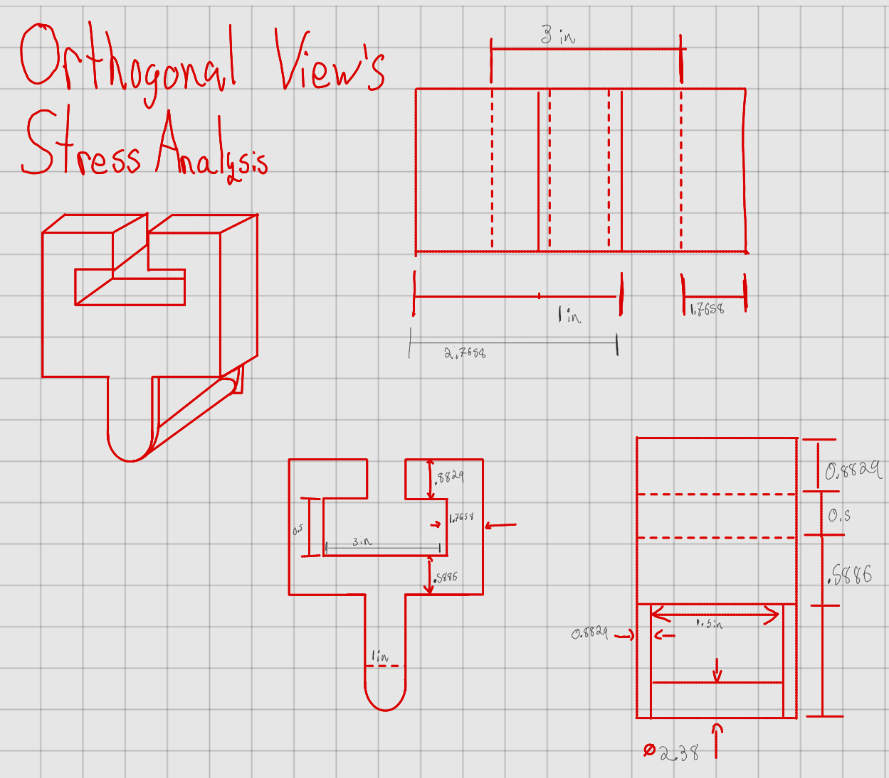
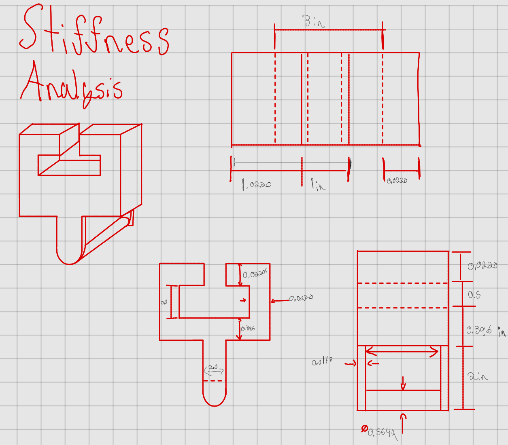

# A5 – [Bracket Design]

## Objective
We were tasked with designing a bracket that will hold a horizontal force applied symmetrically by a strap. The bracket should be able to slide over a rigid T beam, the bracket also doesn't have to adhere to tight tolerances, it should be able to easily slide, since precision isn't the main focus of the assignment.

I was given a set of parameters which included the following _"Design using a safety factor of 4 and applied load in between 500 lbf < F < 800 lbf. Choose one of three metals, aluminum 6061 T6, Steel (ASTM A36), or Titanium (Ti-6Al-V4)."_. What I chose was the following: Safety Factor of 4, P=800 lb, and for the material I chose Steel (ASTM A36). The reason i chose the these parameter is because I wanted to see how strong my design would be after choosing the highest load and choosing a decently strong material.

## Calculating using Stress

Below shows an image of the chosen parameter and the some important properties concerning the material. As mentioned previously I chose Steel (ASTM A36) for the material this material has an Elastic Modulus of 29007547.53 psi or E = 29 Million psi, the material also has another property relevant to us which is Yield Strength, S_y = Yield Strength= 36259.43442 psi = 36,000 psi.

- Properties of A36 from solidworks material list.

We first start off with the question of what size do we need part A to be, and that is governed by how wide the strap we will use, is, which is 3/4" wide and can be found in the following [link](https://www.uline.com/Product/Detail/S-12925/Poly-Cord-Strapping/Heavy-Duty-Polyester-Cord-Strapping-3-4-x-2500?pricode=WA9239&gadtype=pla&id=S-12925)

For CDE I took the given parameters from the T beam and applied them to be the dimensions of the bracket internally. Using those dimension I was able to find my outside dimensions via the series of formulas and relationships.

## Stiffness Calculations

Conditions for stiffness did not see much change, as the material, force, and length of part A was kept the same. However we did add a new parameter and that is max deflection which is equal to 0.005". Below I state the givens and solve for A using equations involving deflection.

I do the same with Part B, and switch it up in parts C-E again, with the use of the T beams dimensions, I internally set those aside and allowed them to help govern/solve for the rest of the unknown dimensions.

## Multi-View Drawings
After solving for the unknown dimension for the bracket, I was tasked with generating two different orthogonal drawings, using the two sets of measurements from the different approaches.

The first drawing showcases the dimensions using stress eqautions.

This second drawing showcases the same view but uses measurements from the stiffness portion of the assignment. 

## Communicate
I learned a lot from this assignment, I learned that there are numerous ways of obtaining dimensions using different equations whether it be stress or deflection related. It also showed me how easy it is to make a simple request on paper hard to design without the adequate parameters already set in place for you. The part that probably took the most time were the drawings, I have a hard time visualizing the pieces and adequately portraying them in 3d orthogonal views

