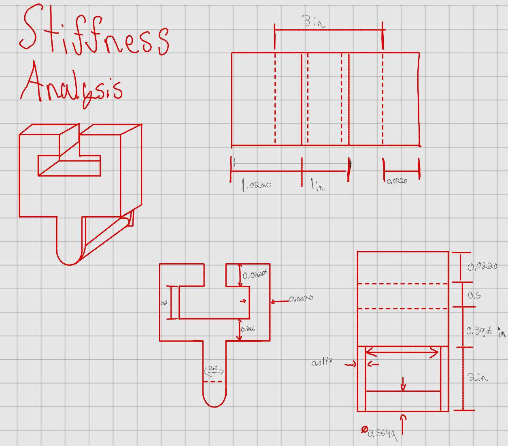
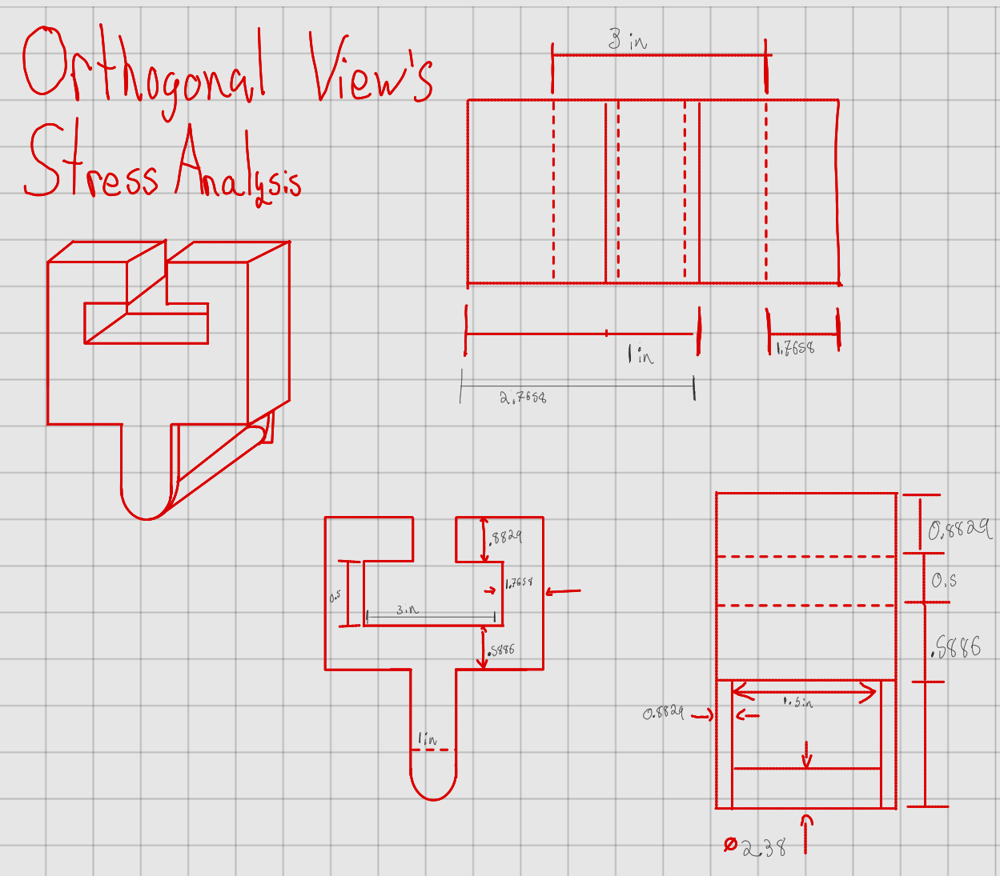
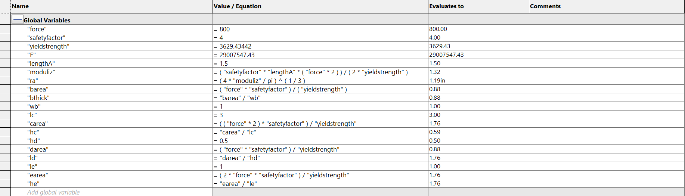
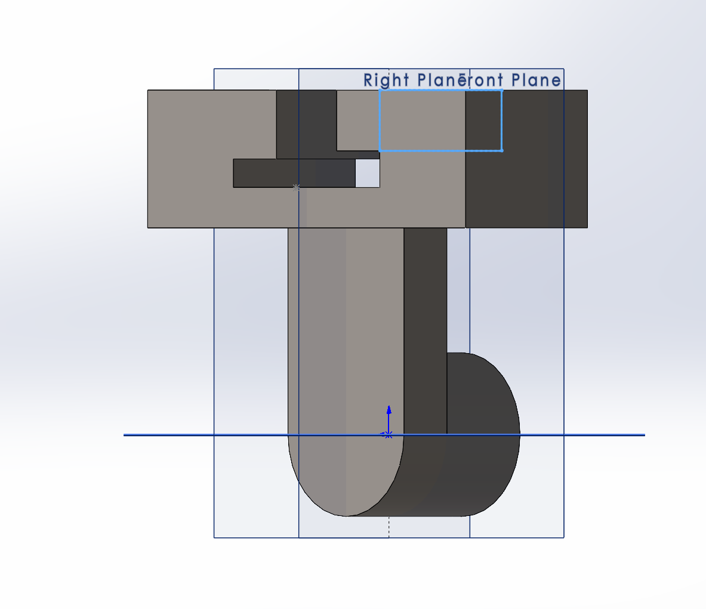
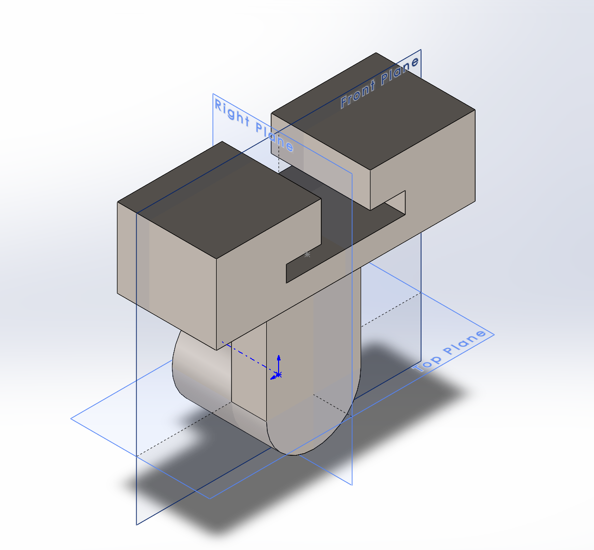
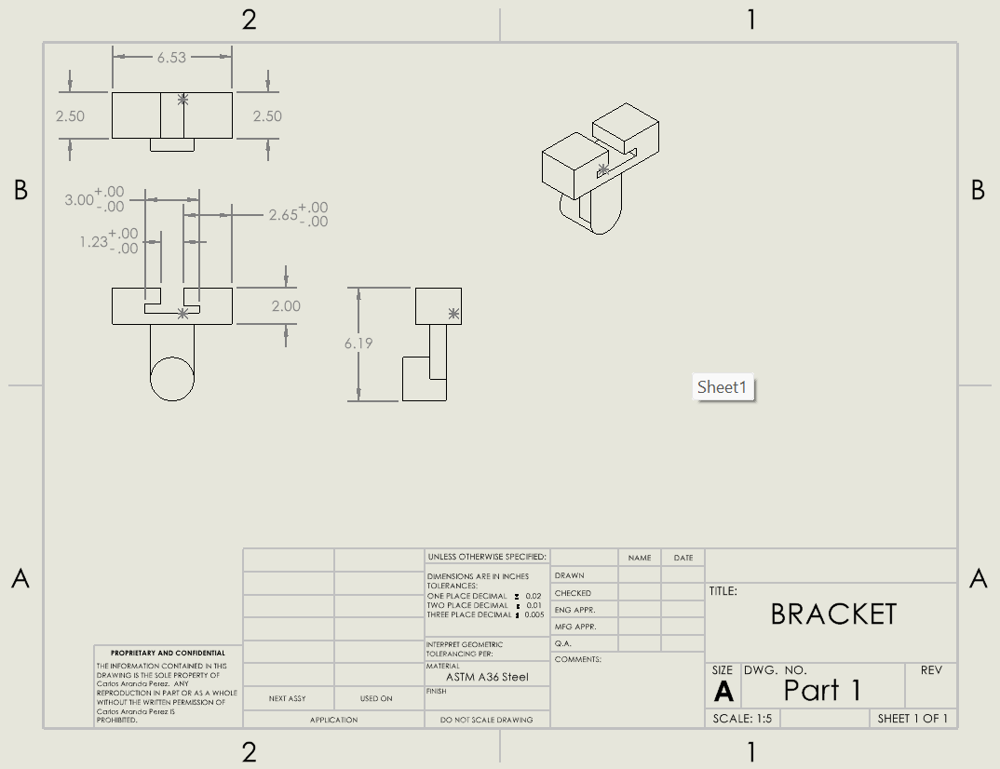

# A6 – [Bracket Drawing]

## Objective
The objective for this weeks assignment was to use last weeks assignments values and create a CAD and CAD drawing to pair with it, to showcase the tight tolerances it has for the T-Beam we are designing the whole thing for.

Below are the drawings and dimensions I will be referencing for this design.

We were given parameters for the stiffness which were the following: " Max Deflection = 0.005 inches" and assume it will not fail", all based on our material of choice.

## Parametric Design 

to start off this assignment we had to show our equations in the global variables section. 
This is where I first noticed a grave mistake in my work from last weeks assignment. 
When inputting my yield strength, I did not input all the correct digits and ended up with a value that was larger, in the moment it seemed fine until I realized that my true value wasn't to be anywhere near that size. I ended up fixing it slightly to achieve better results but it was doomed from the start.

With the equations now set I could now start with feature A which is the rod that will support the strap.

Then using the rest of the equations I mated up the rest of the parts to achieve a final coherent part seen below.

## Drawing
After finishing my part, I then moved onto using that part to reference in my drawing. The drawing was to be done in the third angle projection. It was stated that we could add the symbol for that, although I did find the code needed to generate the symbol in solid, I was not as lucky when it came to finding the file which dictates/uploads the codes for the symbols in my SolidWorks files, so therefore my drawing is not using the third angle projection symbol.

I was also tasked with adding the tolerances to the drawing, I have little knowledge on how to do that in SolidWorks, I thought I had it figured out when I had the proper dimensions and the tolerances show up in the part, but the specified tolerances did not show in the drawing. They only show up as +/- 0.0000, which is frustrating but something I plan to improve upon in the future. 

In the drawing I also included an Isometric View of the part

## Reflection
For feature A, I drove it utilizing the moduli Z equation provided from A5, which I then used to find the radius of feature A. Utilizing the equations tab, I calculated the modulus Z (moduli Z?)  using the safety factor times the weight induced onto it, times the assumed length of feature A, divided by two times the yield strength. Utilizing the resulting value in the equation to then find the radius by multiplying 4 and moduli z, then dividing them by pi, all of that was then root third to get a final radius value. Rather than just simply entering the value I calculated previously, I put all this into my global variables in SolidWorks and applied it to the actual applied load. After doing so and putting this all into SolidWorks, I got an approximate value of 1.2 inches, very similar to the value I ended up calculating. As for if my calculation changed later in the assignment, it did not specifically alter that piece, though I did change my calculation slightly for part D and E, as I had some conflicting beliefs as to how thick the actual part was and its calculations. So I redid it utilizing a different value and solved from there.

I applied tighter tolerances for the following features: C,D, and E. The reason I did this was because the T beam is supposed to fit loosely, in order to ensure that the hole is loose enough I decided that the best course of action was to make sure that when doing the manufacturing process that the hole remains capped around those dimensions. If a non critical feature like A or B were held to a tight tolerance, then the cost to produce this design would increase, because it would then take precision and time to get those easily manufactured parts to the desired tolerances. It is much more reasonable to have tolerances on parts that are going to be mating or sliding on another surface as those features determine whether or not the design can be even installed for usage.

This assignment took me 10 hrs to complete. A good bit of it went to fixing my mistake from the previous equations.(Another chunk of time was then spent pondering why my drawing displayed a different value than my part, turns out I was design the drawing in MKS instead of IPS, rookie mistake honestly.)

This is the [download link the part shown.](part1.SLDPRT)
This is the [link for the drawing.](Part1.2.SLDDRW)
